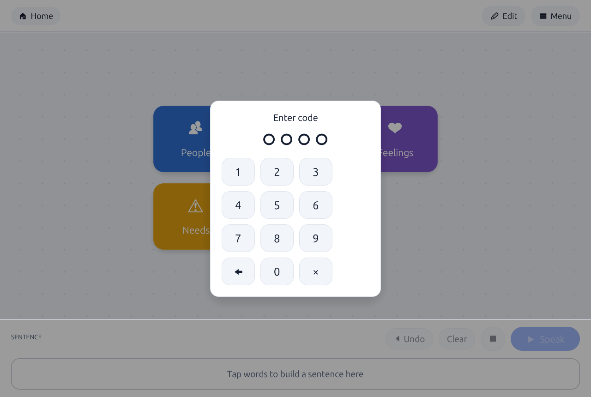

# Communicator — visual system, product theory, and roadmap

This document covers three things:

1. **[What the visual upgrade changed](#1-the-visual-upgrade)** — the design system now in `src/theme.rs` and how the screens use it.
2. **[Why this app is worth building](#2-why-this-app-is-useful)** — who it serves, what it competes with, and where its real advantage lies.
3. **[How to make it genuinely useful](#3-roadmap)** — what shipped since, and what is still missing.

---

## 1. The visual upgrade

### 1.1 Before

The interface was functional but undesigned: default egui greys, flat rectangles painted with `rect_filled`, invisible affordances, no hover or press feedback, no elevation, no empty states, and a category expansion that swapped the screen contents instantly. Every colour and size was a literal in the middle of an 700-line `update()`.

### 1.2 After

Everything visual now derives from a single token module, `src/theme.rs`. Nothing in `app.rs` invents a colour or a radius.

| Token group | Values | Why |
| --- | --- | --- |
| Spacing | `SPACE` 8, `GUTTER` 24, `GRID` 24 | The brief's 24 pt anti-"fat-finger" rhythm, expressed once. Nodes snap to `GRID` on drag release. |
| Node size | 184 × 144 pt | Roughly 4× the 44 pt minimum touch target on every axis — reachable with a fist, a stylus, or a headstick. |
| Radii | node 22, card 18, pill 99 | "Soft-Tech": rounded but not toy-like. |
| Elevation | 4 levels of soft shadow, blur 8→32, no offset drift | Depth without gradients. Disabled entirely in high-contrast mode. |
| Type scale | body 19, button 19, heading 26, node label 21–26 | Sized to be read by a *listener* standing nearby, not only by the user. |
| Palettes | Light / Dark / High contrast | Three complete palettes; every surface, ink, outline and accent is derived per theme. |

**The canvas.** A soft dot grid (48 pt pitch) drawn under the nodes makes the snap grid legible and gives the board a sense of place while panning. When a category is open, the whole canvas takes a 6 % wash of that category's colour — an ambient "you are inside this node" cue that needs no reading.

**The nodes.** One function, `paint_node`, draws every category and term tile: soft shadow, hairline outline derived from the fill, an emoji/icon glyph, and an auto-contrasting label (text colour is chosen by relative luminance, so a user-picked pastel and a user-picked navy both stay readable). Three feedback states, all silent and all animated:

- **hover** — 1.5 % scale-up, deeper shadow, soft inner highlight;
- **press** — 3 % scale-*down* (the tile "gives" under the finger);
- **release** — a colour-matched ripple expands and fades over 450 ms.

The brief asked for confirmation "without the need for haptic or audio feedback". This is that.

**Semantic zoom.** Opening a category no longer swaps the screen. The tapped tile's centre becomes the camera origin: the rest of the plane scales up and fades out *past* the viewer, while the category's words scale up from that same point. Going back plays it in reverse. Both directions are 240 ms, cubic-out. Nodes are non-interactive during the flight, which also kills the mis-tap that a mid-transition tap used to cause.

**Wayfinding.** A breadcrumb in the top bar always reads `Plane › Category`, with the category chip tinted its own colour. The Back button sits at a fixed canvas position (24, 24) — never moving, never scrolling away — and the plane chip is also a tap target for going back.

**The dock.** Words land as pill chips filled with the parent category's colour, so the sentence carries its grammatical colour-coding — *People* blue, *Actions* green, *Needs* amber. Tapping a chip removes it (a red ✕ badge fades in on hover so the affordance is discoverable but never in the way). `Undo` and `Clear` are disabled rather than hidden when the dock is empty, and an empty dock shows a dashed placeholder that says what to do instead of showing a void.

**The ghost menu.** Still summoned only on demand, but now a floating card with real elevation that can be dragged anywhere on screen — the reach-zone accommodation from the brief. Planes are full-width 52 pt rows with their icon; the active one is filled with the accent colour.

**Settings.** Rebuilt as sections in sunken cards: appearance (theme, interface size, language), planes (add / rename / re-icon / delete with automatic re-homing of orphaned categories), and vocabulary (category list with colour rails, plus an editor with 10 preset swatches, a `#RRGGBB` field, an icon field, a plane picker, and per-word rows). It closes with a 180 × 52 pt **Done** button, because a 16 pt window ✕ is not a target this audience can hit.

**Interface size.** A slider drives egui's zoom factor from 80 % to 180 %, scaling the entire UI — the single highest-leverage accessibility control in the app, and it persists.

### 1.3 Beyond pixels

Three changes were structural rather than cosmetic, because the visuals were meaningless without them:

- **Planes became real.** They were a label that changed a string. Now every category belongs to a plane, the canvas shows only the active plane's categories, and planes can be created, renamed, re-iconed and deleted. Without this, the breadcrumb had nothing to say.
- **Icons became data.** `Category` and `Term` each carry an `icon: String`. The brief asked for "a high-contrast emoji or photo indicator"; this is the emoji half. (See [3.2](#32-next-weeks-1-4) for the photo half.)
- **Theme, scale and plane are persisted**, and every new field has a `#[serde(default)]` so an older saved board still loads.

Rendering was verified end-to-end by driving the real binary headlessly (Xvfb + software GL) with synthetic pointer events and capturing framebuffers — the screenshots above are the actual app, not mockups.

### 1.4 What was deliberately not done

- No auto-layout of nodes. Positions are the user's motor memory; see [2.3](#23-the-actual-differentiator).
- No image assets. Every icon is a font glyph, and the ones used are checked against the bundled fonts by rendering them, not by trusting a table.

### 1.5 The follow-up pass: from point board to speech device

The design work above made the app legible. A second pass made it usable by someone who actually depends on it — the five blockers from the first version of this roadmap, now shipped:

| Shipped | What it does | Where |
| --- | --- | --- |
| **Speech output** | A `Speak` button in the dock reads the sentence aloud, with a stop control, an optional speak-each-word-as-tapped mode, and a speed setting. | `src/speech.rs` |
| **Board export / import** | Copy the whole board to the clipboard as versioned JSON and paste it back on any device. | Settings → Board data |
| **Undo** | A 25-deep stack of restore points around every structural edit, with an `Undo edit` control that appears in the top bar the moment there is something to undo. | `push_undo` / `undo` |
| **Delete guards** | Deleting a category or a plane asks first, and says exactly what will be lost ("3 words will be deleted with it"). Deleting a plane re-homes its categories rather than dropping them. | `confirm_dialog` |
| **Edit lock** | Editing unlocks on a press-and-hold (with a filling progress bar) or a four-digit PIN on a large keypad. Leaving edit mode stays a single tap. | `edit_button` / `pin_prompt` |
| **Accessibility metadata** | Every hand-painted node, chip and badge now registers a label with AccessKit, so a screen reader sees words rather than an empty window. | `widget_info` calls |

Speech is deliberately dependency-free: the web build uses the browser's `SpeechSynthesis`, and the native build drives whichever system binary exists (`spd-say`, `espeak-ng`, `say`, `PowerShell`). If none is found, the app says so in Settings instead of showing a button that does nothing — and the whole speech UI hides itself rather than promising something it cannot deliver.

Fifteen unit tests now cover the parts most likely to break silently: pan clamping, grid snapping, easing, hex parsing, contrast of every preset colour in every theme, board round-tripping, undo, plane deletion, and the PIN rule.

---

## 2. Why this app is useful

### 2.1 The user

Augmentative and Alternative Communication (AAC) users are people who cannot rely on speech: cerebral palsy, ALS/MND, post-stroke aphasia, late-stage Parkinson's, traumatic brain injury, autism with limited speech, or a temporary state such as intubation in an ICU. The README targets the hardest sub-case — **non-verbal *and* limited dexterity** — which rules out dense keyboard grids and small targets.

There are two users, not one, and they never use the app at the same time:

- **The speaker** taps and needs zero cognitive overhead, huge targets, and a board that never rearranges itself.
- **The carer / SLP / family member** configures the board, and needs a rich editor, backup, and the ability to change a board in thirty seconds while the speaker waits.

Communicator already recognises this split (Edit mode vs. normal mode). That is the single most important structural decision in the app, and it should be made even sharper.

### 2.2 The market gap

- Dedicated AAC hardware runs into thousands of dollars and is usually gated behind insurance or a health service.
- The strong iPad apps (Proloquo2Go, TouchChat, LAMP Words for Life) sell for roughly £150–£250 per licence, iOS-only, and their vocabularies are English-first.
- The free tier is thin, and the *non-English* free tier is close to empty. Turkish AAC vocabulary in particular is scarce — and this codebase already ships Turkish alongside English.

A free, offline-capable, installable web app that runs on any borrowed tablet or laptop, with no account and no store, is a real gap — especially for hospitals (a board that can be spun up for one patient for one week) and for families outside the English-speaking market.

### 2.3 The actual differentiator

Most AAC apps are **grids**. Communicator is a **spatial canvas**: the carer places tiles anywhere and they stay exactly where they were put.

That sounds like a cosmetic difference. It is not, and it cuts both ways:

- **The win — motor planning.** The reason clinical systems like LAMP work is that a word's *location* never changes, so selecting it becomes muscle memory rather than a visual search. A canvas with persistent coordinates supports this perfectly, and lets the carer shape the layout around a specific person's reach: everything within a 15 cm arc on the left, if that is what the person can reach.
- **The risk — clutter and drift.** Free positioning also allows overlapping, unreachable and forgotten tiles. The grid snapping and pan clamping added in this pass are the first defences; auto-layout must never be added.

The second differentiator is **planes as contexts**. Clinicians already build "environmental boards" — one for the dinner table, one for the ward. Making that a first-class object, with a one-tap switch and its own spatial layout, matches how the domain actually works.

### 2.4 Honest assessment

The app now speaks, so it has crossed from **point board** into **speech device** — a different category of product, and the one that matters: the user can address someone who is not looking at the screen. It also survives a cleared cache, and it can no longer be dismantled by a stray tap.

What it still is not is a device someone can use *without their hands*. Every interaction assumes a pointer that can be aimed and clicked. Until switch scanning and dwell selection exist, the addressable user is someone with limited but functional dexterity — a large group, but not the whole one, and not the group with the least alternatives. That is why the roadmap now starts where it does.

---

## 3. Roadmap

Ordered by "how much does this change whether a real person can use the app", not by effort.

### 3.1 Shipped — the blockers are cleared

The items that used to sit here (speech, backup, undo, delete guards, edit lock, accessibility labels) are described in [1.5](#15-the-follow-up-pass-from-point-board-to-speech-device). What is worth recording is what each of them taught:

- **Speech had to be dependency-free.** Linking a speech library would have broken the cross-compilation matrix (musl, arm, Windows) that makes this app installable anywhere. Driving the system binary costs a process spawn and buys every target.
- **Backup had to avoid a file picker.** A native file dialog is another dependency with its own platform problems; the clipboard plus a visible text box works identically on web and desktop, and a carer can paste it into whatever they already trust.
- **Undo made confirmations cheaper, not redundant.** The dialog still exists for the two actions that destroy more than one thing, but it can now honestly say "you can undo this", which is what makes a confirmation tolerable rather than nagging.

### 3.2 Next — what actually blocks a user now

**1. Switch and dwell access.** Tapping is not the only input. The clinical standard for severe motor impairment is **single- or dual-switch scanning**: the board highlights each tile in turn and the user hits one switch to select. Add:
- row/column or linear scanning with a configurable step time;
- dwell selection (hover for N ms to activate) for eye-gaze and head-pointer users;
- release-activation and a hold-to-activate delay so a tremor or a dragged finger does not fire the wrong tile.
This is the single change that widens the addressable user base the most.

**2. A persistent core-word bar.** Around 200 "core words" (*I, want, go, more, stop, help, no, again*) account for the large majority of everything anyone says. Burying them one level deep costs two taps every time. A always-visible strip of 8–12 pinned words, above the dock, is the highest-frequency saving available.

**3. Photos, not just emoji.** A photograph of *their* mug, *their* carer, *their* street is more recognisable than any pictogram — this is well established in the literature and universally requested by families. Needs an image loader, a picker, and a move from `localStorage` (~5 MB) to IndexedDB on the web.

**4. A better sentence dock.** Reorder by drag and insert at a position — a mis-tapped word can still only be removed, not moved. A large plain-text line of the sentence at listener-distance type size would also help the partner read along while it is being built.

**5. Phrase bank.** Whole utterances that are needed instantly and identically every time — "I need to lie down", "Call my mother", "That hurts". One tap, no assembly. In an emergency, sentence-building is the wrong interaction.

### 3.3 Later — the product, not the app

**6. Multiple profiles**, so one tablet serves a family, a ward or a classroom.

**7. Usage insight for the therapist.** Which words are actually used, which are never touched, which are hunted for. This is how a speech therapist tunes a board between sessions. It must be local-only and explicitly opt-in — this is medical-adjacent data about a person who may not be able to object.

**8. Vocabulary starter packs.** A blank board is an intimidating first run for a carer in a hospital corridor. Ship curated sets — *Hospital*, *Home*, *School*, *Post-stroke* — in English and Turkish. The board format and its loader already exist, so a pack is now just a JSON file and a button: this is the cheapest large win left.

**9. Sharing a board.** The clipboard export already moves a board between devices; a QR code or a file picker would make it a two-tap operation rather than a copy-paste. Anything cloud-based must stay optional — many families will not accept an account.

**10. Text entry with prediction** for literate users who prefer to spell, with the board as fallback.

**11. Localisation beyond two languages,** moving the two string tables out of `app.rs` into data files so a translator never has to touch Rust. Turkish is the wedge; Arabic, Kurdish and Urdu are similarly underserved and would need RTL support.

### 3.4 What to validate before building much more

Everything above is a hypothesis. Five sessions with two real users and one SLP would settle most of it:

| Question | How to measure |
| --- | --- |
| Is the spatial canvas better than a grid for this user? | Taps-to-target and mis-taps for the same 10 words in both layouts |
| Does semantic zoom preserve the mental map? | Can the user find a word 24 h later without a hint? |
| Is 184 × 144 the right tile size? | Mis-tap rate per size, per user — expect it to differ wildly |
| Can a carer build a usable 30-word board unaided? | Time-to-first-sentence, and where they get stuck |
| Do the category colours actually speed up selection? | Selection time with colour vs. a monochrome build |

The metric that matters is not sessions or retention. It is **utterances per day** and **time-to-first-utterance for a new user** — everything else is a proxy.

### 3.5 Technical debt

Cleared in the follow-up pass:

- ~~Schema versioning~~ — every board carries a `schema_version`, checked on import, and a board from a newer version is refused with an explanation rather than half-loaded.
- ~~The `t()` string table~~ — translations are now two static tables in the same key order, so adding a language is a data change and moving them to a file is a small step rather than a refactor.
- ~~Geometry tests~~ — pan clamping, snapping and easing are pure functions with tests.
- ~~Unbounded icon fields~~ — capped at eight characters, enough for a ZWJ sequence and not enough for a paragraph.

Still open:

- **Bundled fonts only cover a subset of emoji.** The font shipped with `epaint` lacks several common glyphs (🤲, 🤕, 🧑, ZWJ sequences, ↶, ≡, ✕), which render as empty boxes. Every glyph the app uses has been checked by rendering it, but a carer typing their own icon has no such protection. Either bundle a fuller emoji font or replace the free-text icon field with a picker of glyphs known to exist.
- **Undo does not cover renames.** Typing into a node is not snapshotted, because snapshotting per keystroke would flood the stack; a debounce on focus-loss would fix it.
- **Speech has no voice picker.** The engine's default voice for the language tag is used. Users with a preference (or a bad default) cannot change it yet.
- **The native speech backend spawns a process per utterance.** Fine at conversational rates; it would need a persistent connection if speak-on-tap were used heavily.
